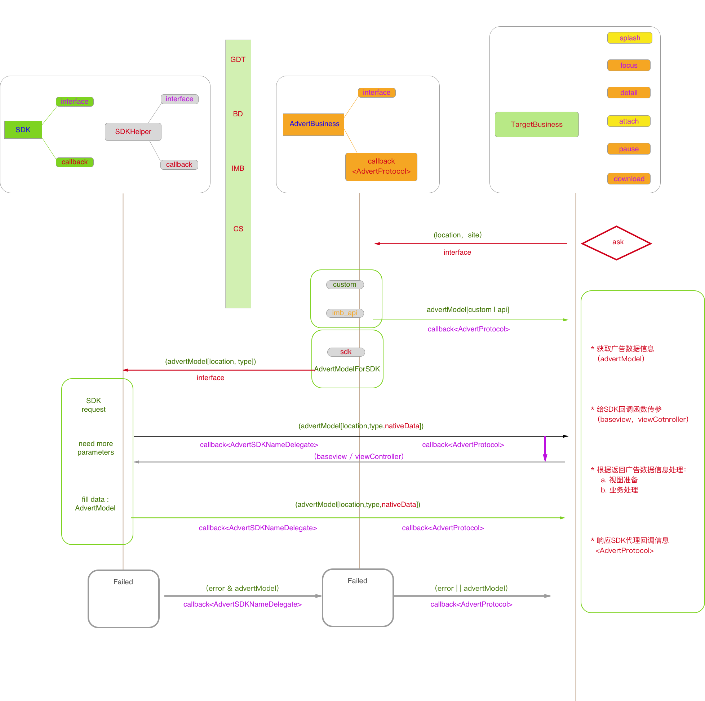
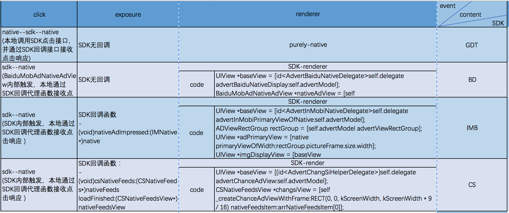
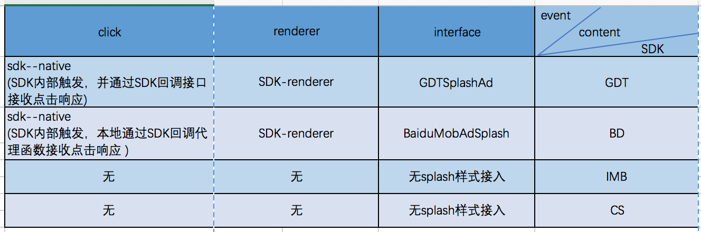

## advertBusiness_md

> 文档目的在于记录<!--影视大全-->项目中广告接入引擎的设计结构，希望有利于后期的维护与拓展开发。


#### 广告引擎设计"三座大山"：
1. 业务需求
2. SDK处理
3. 维护和拓展

#### 目标：将以上三个点整合，使得业务需求与SDK的处理能够达到易维护、拓展性高。
* 业务处理模块相对独立于SDK的处理， 不过无论是业务需求还是SDK处理都是比较具体明确的东西<产品文档&SDK接入文档>。
* 对于容易维护可拓展，常规指标是代码对一些设计原则的遵守和运用，尽力高内聚、低耦合。
* 抽取广告业务需求共同点设计功能实现，对于SDK也是通过抽象处理共同点，对特殊点做兼容的方式来设计接口。

<!---->
> 下面八个部分对<!--影视大全-->的广告设计以及代码结构逻辑做说明。这个文档对大致结构设计做了说明，部分细节处理需要从代码中做参考，为了继续完善文档缜密性，后面将会添加多个补充内容，或对于已有内容做调整补充。

#### 一 项目使用advertBusiness设计结构图：



#### 二 AdvertBusiness
1. 处理广告请求和广告数据的业务主类,
    *  id<AdvertProtocol>:AdvertBusiness外发的广告业务回调接口，是所有SDK共性或者特殊回调的转接协议。
    * 通过SDKHelper代理所有SDK广告请求，完成AdvertSDKProtocol到AdvertProtocol的转换桥接。
    * 支持广告位和确定广告类型:

```
//1. 支持广告位
typedef NS_ENUM (NSUInteger, AdvertLocation) {
    AdvertLocationLaunch = 10,
    AdvertLocationRecommend,
    AdvertLocationDownload,
    AdvertLocationDetail,
    AdvertLocationAttach,
    AdvertLocationPlayerPause,
};
//2. 确定广告类型
typedef NS_ENUM (NSUInteger, AdvertType) {
    AdvertTypeNone            = 1,       // when none dismiss
    AdvertTypeCustom          = 2,       //用户自定义
    AdvertTypeBaidu           = 100,     //百度
    AdvertTypeBaiduNative     = 101,
    AdvertTypeGDTLaunch       = 102,     //广点通开屏
    AdvertTypeGDTNative       = 103,
    AdvertTypeInMobiAPINative = 15,     //InMobi_API原生（静态）广告
    AdvertTypeInMobiAPIAttach = 16,     //InMobi_API视频广告
    AdvertTypeInMobiSDKNative = 18,     //InMobi_SDK原生广告
    AdvertTypeChanceSDK       = 19,     //畅思信息流广告
};
```


#### 三 SDK
1. SDK目前有四个【GDT、BD、IMB、CS】
    *   一般情况都提供了多种广告类型,每一种广告类型所需要调用和回调的函数可能不相同。【我们接入类型有开屏，原生(信息流)】。
    *   注意SDK提供的代理函数中要求传入参数的情况【GDT……ViewController, BD……UIView】
    *   注意不同SDK原生广告绘制策略不同，在设计接口的时候需要做兼容处理。  
    *   关于不同SDK广告处理异同可以参考Excel中罗列内容。 


3. . AdvertSDKHelper
    1. 定义抽象类用来提供和实现调用SDK的接口，
    2. 其衍生类中定义不同SDK的回调代理函数。
        * AdvertBaiduHelper : AdvertSDKHelper
        * AdvertGDTHelper : AdvertSDKHelper
        * AdvertInMobiHelper : AdvertSDKHelper
        * AdvertChangSiHelper : AdvertSDKHelper
     
    3. 注意集中处理每一个SDK可以处理的上报内容，对于需要特殊处理的上报通过回调函数(id<SDKHelperProtocol>)放出到AdvertBusiness中，让后AdvertBusiness再通过(id<AdvertProtocol>)外放到对应TargetBusiness去处理。上报接口统一定义在类AdvertReportBase中。

#### 四 AdvertModel
1. 负责存储所有相关广告的讯息，包括原生广告数据。【Location,Type,NativeData,appednInfo[badge,focusIndex,showtype,attachDuration……]】
2. 从AdvertBusiness中请求成功开始，AdvertModel将贯穿整个广告业务主线，包括显示、交互和上报业务。
3. 在AdvertBusiness里面服务器成功返回之后进行初始化。如果是SDK广告，则在SDK请求返回后补充完整；如果不是SDK广告，譬如是直投广告或者InMobiApi广告，则是在AdvertBusiness中由服务器接口返回数据将属性填充完整。

#### 五 AdvertReportBase
1. 定义广告业务相关的数据上报接口
2. 关于上报处理基本上都在广告引擎接口中(AdvertBusiness+AdvertSDKHelper)处理，对于特殊的上报则放出去。
    > 需要外放处理的上报：
    1. launchView广告关闭<!--- (void)closeAdvertSplash-->
    2. AdvertAttachView点击跳过广告<!--- (void)skipADView-->
    3. PlayerViewController+AD，隐藏暂停广告<!--- (void)hiddenPauseAdvertClick-->
    4. RecommendBannerView，焦点轮播图广告曝光<!--- (void)repoartAtCurrentIndex:(NSInteger)showIndex-->
     
3. 广告上报类型：

```
typedef NS_ENUM (NSUInteger, AdvertReportType) {
    AdvertReportTypeServerRequest = 100, //服务器请求
    AdvertReportTypeServerGetSuccess,    //服务器数据返回成功
    AdvertReportTypeServerGetFail,       //服务器数据返回失败
    AdvertReportTypeServerGetException,  //服务器数据返回数据有误
    AdvertReportTypeServerGetTimeOut,    //服务器请求超时（开屏广告请求使用）
    AdvertReportTypeSKDReqeust,          //SDK进行请求
    AdvertReportTypeSDKSuccessGet,       //SDK数据正确返回
    AdvertReportTypeLocalDeadLineForSDK, //APP本地设定超时。
    AdvertReportTypeSDKRequestTimeOut,   //SDK请求超时
    AdvertReportTypeSDKFailure,          //SDK请求数据失败
    AdvertReportTypeSDKErrorCode,        //SDK返回错误码统计
    AdvertReportTypeExplosure,           //广告曝光
    AdvertReportTypeClick,               //广告点击
    AdvertReportTypeClose,               //广告关闭(人为手动打断结束关闭广告【splash、pre-roll、pause】)
    AdvertReportTypeEnd,                 //广告结束（广告自然播放结束 - 【splash、pre-roll】 ）
    AdvertReportTypeReady,               //广告准备完毕
};
```

#### 六 不同SDK广告接入整理
1. SDK原生广告接入（Native）


2. SDK开屏广告接入（luanch/splash）


3. 补充说明
    1. sdk_native.png中关于渲染处理(renderer), *BD IMB CS*三个都是SDK提供了渲染接口，但是都需要baseView是从业务（TargetBusiness）传入，在文档设计中处理相同，参看协议@protocol(AdvertProtocol)定义代理函数，以及id<AdvertProtocol>对象的处理.

        ```
        /*
         * 提供SDK的代理并传renderer所需依赖视图baseView。 【 BD | IMB | CS 三种原生广告会走这个代理】
         */
         - (UIView *)advertBaseViewForSDKNative:(AdvertModel *)advertModel;
        ```

    2. 关于曝光(exposure)，*IMB CS*两个SDK是有广告曝光追踪回调函数的，这样有利于确保<!--影视大全-->自己的曝光统计与SDK自身的曝光统计一致。对于没有回调函数参考的，默认处理为SDK取到广告素材[BaiduMobAdNativeAdObject,GDTNativeAdData],并且渲染到界面作为曝光时机。
        > 注意，开屏广告时候，*GDT BD*除了有原生广告之外，还有自己的splash广告类型，这时候他们都有可以参考的曝光回调函数。

        ```     
        - (void)splashSuccessPresentScreen:(BaiduMobAdSplash*)splash；// BD
        - (void)splashAdSuccessPresentScreen:(GDTSplashAd*)splashAd;  // GDT
       ```        
    
    3. 关于点击交互(click), 处理*GDT-native*需要主动调用之外，其余SDK广告[Native/Splash]均是SDK内部触发。此处的接口设计原则是，无论是否是sdk内部触发，都需要从外部(TargetBusiness)像广告引擎(AdvertBusiness)发送一条点击消息，在AdvertBusiness内部做必要的上报或者消息向SDKHelper的再传递或者是截断处理。
    
        ```
        /**
         * 点击广告【必选】
         * 广告点击的时候务必调用这个函数
         * @param advertModel 广告模型
         * @param completion 回调函数，如果actionURL不为空，那么在回调block中进行跳转。
         */
        - (void)advertClick:(nullable AdvertModel*)advertModel completion:(nonnull void (^)(NSString *actionURL))completion;
        ```
         

#### 七 开屏广告处理
1. 开屏广告视图类：LaunchView
2. 光宇SDK数据的开屏广告分为两种类型：
    1. SDK-Splash, SDK提供了splash广告类型，并且我们的产品接入了这种splash-style的广告，
        * 产品上，*GDT BD*两种SDK都有splash类型的广告接入，此时LaunchView从advertBusiness请求得到广告类型如果是[AdvertTypeGDTLaunch / AdvertTypeBaidu]splash非原生渲染的类型，那么AdvertSDKHelper将直接在开屏视图类LaunchView实例中进行初始化，进行SDK-splash广告请求的所有委托代理将不再经过advertBusiness。目前这样处理有两个原因：
            1. 开屏广告只在LaunchView中使用到，splash类型广告相关代理函数没有必要在经过advertBusiness传递。
            2. advertBusiness设计较多代理比较相近的广告业务，而将splash单独处理出去，可以减轻它的负担。
    2. SDK-Native， 开屏LaunchView支持目前所有SDK已经接入的元素广告类型。对于SDK-Native广告的处理，luanch与其它所有广告位[focus,detail,download,pause,attach]都是通过（ <->AdvertBusiness <---> AdvertSDKHelper）这条通路来处理.所以相关逻辑代码基本一致。
    
    
       
#### 八 非SDK广告处理
> 目前非SDK广告类型有两种：

1. 直投广告， AdvertTypeCustom

2. InMobi-API 广告，【AdvertTypeInMobiAPINative， AdvertTypeInMobiAPIAttach】
    * AdvertTypeInMobiAPIAttach 只在attach广告位出现

3. 以上两种广告的最后对外(targetBusiness)的回调接口都是：
 
    ``` 
    /*
     * 自定义广告数据（通过服务器组织的广告数据- ext: Ad_InMobi | Ad_Customer）回调
     */
    - (void)advertForCustom:(AdvertModel *)advertModel;
    ```
4. 对于api广告    


#### 补充
1. SDK-Renderer 本地适配处理

2. 广告错误状态码上报区分兼容

3. 测试广告plist文件读取code_demo

4. 开屏广告与AppDelegate分离处理*轻量AppDelegate*，可参考github项目XHLaunchAdView的模式。


